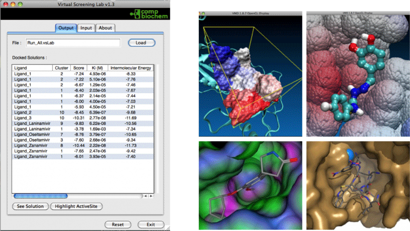
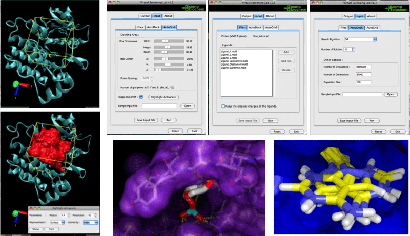

# Introduction
Molecular docking is becoming an important part in the process of developing new drugs. There is much docking software that has been successfully used in a myriad of keystone problems, however, as commonly happens with most of the scientific software, the programs are often complex and a deep knowledge is required for the common user to carry out standard steps.

This is an obstacle and a cornerstone issue for the research teams in the fields of Chemistry and the Life Sciences, who are interested in conducting this kind of calculations but do not have enough programming skills.

To overcome these limitations, we have designed vsLab (Virtual Screening LABoratory), an easy-to-use graphical interface for the well known molecular docking software AutoGrid/AutoDock that has been included into VMD as a plug-in. This program allows almost anyone to use AutoDock and AutoGrid for simple docking or for virtual screening campaigns without requiring any deep knowledge about these techniques.

The potential associated to this software makes it an attractive choice not only for educational purposes, but also for more advanced users that can use vsLab to increase workflow and productivity of everyday tasks.

## Minimum Requirements

Operating System: macOS, Linux or Windows
Visual Molecular Dynamics (VMD) 1.9.1 or later

## Installation

You could install molUP through [vmdStore](https://github.com/portobiocomp/vmdStore) (Recommended).

## Contacts
If you have any suggestion of new features, please contact us: nscerque@fc.up.pt

## Citation
Cerqueira, N. M. F. S. A., Ribeiro, J., Fernandes, P. A. and Ramos, M. J. (2011), vsLab—An implementation for virtual high-throughput screening using AutoDock and VMD. Int. J. Quantum Chem., 111: 1208–1212.

## DOI
http://doi.org/10.1002/qua.22738